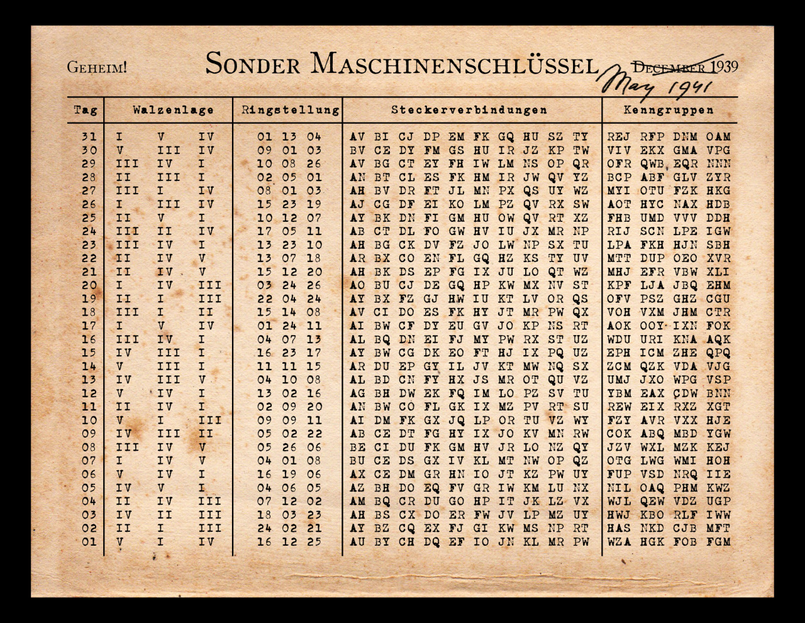
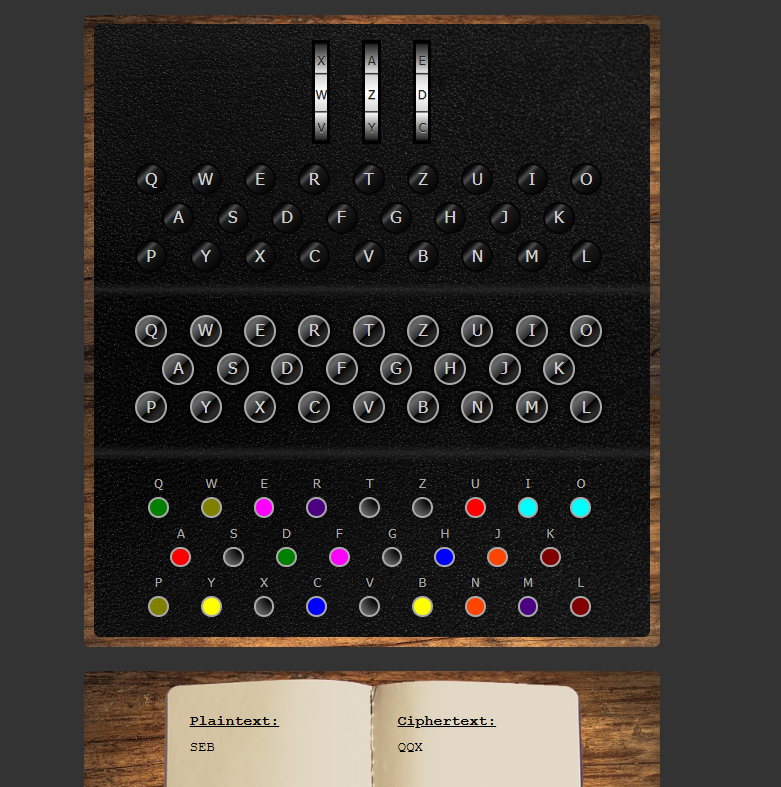
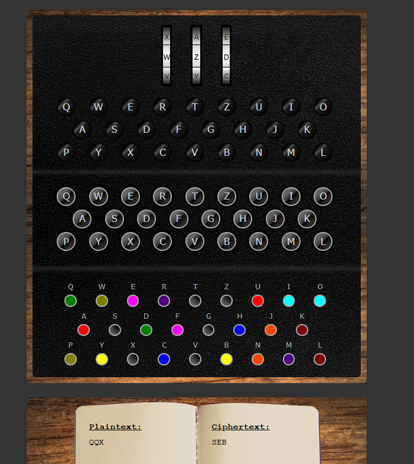

# Exercitiul 1.1

`One Time Pad este un sistem de criptare perfect sigur daca este folosit corect.`

[rezolvare](https://gchq.github.io/CyberChef/#recipe=From_Base64('A-Za-z0-9%2B/%3D',true,false)XOR(%7B'option':'Hex','string':'ecb181a479a6121add5b42264db9b44b4b48d7d93c62c56a3c3e1aba64c7517a90ed44f8919484b6ed8acc4670db62c249b9f5bada4ed474c9e4d111308b614788cd4fbdc1e949c1629e12fa5fdbd9'%7D,'Standard',false)&input=bzkva2hDM1BmMy85Q3lOQ2JkekhQeTVvb3JjY0Vhd1pTRnQzbWdDaWNSbmloRFNNOE9iaGxwM3Z2aUFWdUJiaU90Q1N6Nmh1c0JXcWhmRjBRLzhFWis2aUk5S3lnRDNoQWZGZ256eXY5dz09&ieol=CRLF&oeol=VT)

# Exercitiul 1.2

## Interpretare 1
`Orice text clar poate obtinut dintr-un text criptat cu OTP dar cu alta cheie..` in Base64 are lungimea 104, dar textul criptat are in Base64 lungimea 108 => nu se poate

[calcul](https://gchq.github.io/CyberChef/#recipe=To_Base64('A-Za-z0-9%2B/%3D')&input=T3JpY2UgdGV4dCBjbGFyIHBvYXRlIG9idGludXQgZGludHItdW4gdGV4dCBjcmlwdGF0IGN1IE9UUCBkYXIgY3UgYWx0YSBjaGVpZS4u)

## Interpretare 2
```Orice text clar poate obtinut dintr-un text criptat cu OTP dar cu alta cheie..<space>``` cu un space la sfarsit, are in Base64 lungimea 106

[rezolvare](https://gchq.github.io/CyberChef/#recipe=From_Base64('A-Za-z0-9%2B/%3D',true,false)XOR(%7B'option':'UTF8','string':'Orice%20text%20clar%20poate%20obtinut%20dintr-un%20text%20criptat%20cu%20OTP%20dar%20cu%20alta%20cheie..%20'%7D,'Standard',false)To_Hex('None',0)&input=bzkva2hDM1BmMy85Q3lOQ2JkekhQeTVvb3JjY0Vhd1pTRnQzbWdDaWNSbmloRFNNOE9iaGxwM3Z2aUFWdUJiaU90Q1N6Nmh1c0JXcWhmRjBRLzhFWis2aUk5S3lnRDNoQWZGZ256eXY5dz09&ieol=CRLF&oeol=CR)

[verificare](https://gchq.github.io/CyberChef/#recipe=From_Base64('A-Za-z0-9%2B/%3D',true,false)XOR(%7B'option':'Hex','string':'ecad8de748ef0b1a857f032101bdb51f5e07c3c37931c37b3c3219ef748215708cf046a18588c1e2f897ca0076ca7f924eb1e6efcb1b905afed5d110228d24049b8242bec6e11d82699409fa1281d7'%7D,'Standard',false)&input=bzkva2hDM1BmMy85Q3lOQ2JkekhQeTVvb3JjY0Vhd1pTRnQzbWdDaWNSbmloRFNNOE9iaGxwM3Z2aUFWdUJiaU90Q1N6Nmh1c0JXcWhmRjBRLzhFWis2aUk5S3lnRDNoQWZGZ256eXY5dz09&ieol=CRLF&oeol=CR)


# Exercitiul 1.3

- Daca lungimea cheii este diferita de lungimea mesajului, se pierde informatie la criptare/decriptare.
- Generarea unei chei cu adevarat random este problematica
- Daca atacatorul stie mesajul criptat si necriptat, atunci poate afla cheia, cu care poate sa decripteze orice mesaj criptat ulterior

# Exercitiul 2

### 1. Un sistem istoric de criptare ce foloseste metoda substitutiei este Cifrul lui Cezar. 

In criptare toate literele din alfabet sunt deplasate cu un pas constant la stanga sau la dreapta. 

Sistemul este foarte slab, deoarece exista doar 25 de deplasari distincte posibile (daca dimensiunea alfabetului este 26), iar acestea pot fi sparte cu forta bruta.

**Exemplu de criptare:**  
Luam pasul de deplasare la dreapta de K = 1

SEB => TFC

**Exemplu de decriptare:**  
Se realizeaza operatia inversa a criptarii => K' = -1

TFC -> SEB

### 2. Un sistem istoric de criptare ce foloseste metoda transpozitiei este Cifrul Columnar

Acest cifru rearanjează literele mesajului într-un tabel conform unei chei, fără a le înlocui cu alte caractere.

**Exemplu de criptare:**  

mesaj = "EXAMEN"
cheia = 312

| 3 | 1 | 2 |
| - | - | - |
| E | X | A |
| M | E | N |

| 1 | 2 | 3 |
| - | - | - |
| X | A | E |
| E | N | M |

=> mesaj criptat = "XAEENM"

**Exemplu de decriptare:**  

mesaj criptat = "XAEENM"  
cheia = 312  

| 1 | 2 | 3 |
| - | - | - |
| X | A | E |
| E | N | M |

| 3 | 1 | 2 |
| - | - | - |
| E | X | A |
| M | E | N |

=> mesaj decriptat = "EXAMEN"  

Sistemul este foarte slab, deoarece este suficient sa gasesti un rand corect, sau un cuvant pentru a sparge intregul mesajul. 

# Exercitiul 3

**Noul alfabet:**  
A = u  
B = w  
C = s  
D = h  
E = a  
F = c  
G = t  
H = i  
I = q  
J = e  
K = d  
L = b    
M = o  
N = l  
O = r  
P = m  
Q = p  
R = g  
S = x  
T = k  
U = v  
V = y  
W = n  
X = j  
Y = f   
Z = z  

**Textul decriptat:**  
alice and bob are the worlds most famous cryptographic couple. since their invention in 1978, they have at once been called inseparable, and have been the subject of numerous divorces, travels, and torments. in the ensuing years, other characters have joined their cryptographic family. theres eve, the passive and submissive eavesdropper, mallory the malicious attacker, and trent, trusted by all, just to name a few. while alice, bob, and their extended family were originally used to explain how public key cryptography works, they have since become widely used across other science and engineering domains. their influence continues to grow outside of academia as well: alice and bob are now a part of geek lore, and subject to narratives and visual depictions that combine pedagogy with in-jokes, often reflecting of the sexist and heteronormative environments in which they were born and continue to be used. more than just the worlds most famous cryptographic couple, alice and bob have become an archetype of digital exchange, and a lens through which to view broader digital culture. q.dupont and a.cattapan cryptocouple

https://cryptocouple.com/Alice%20and%20Bob%20-%20DuPont%20and%20Cattapan%202017.pdf


```
#include <iostream>
#include <string>
#include <unordered_map>

using namespace std;

string str = "ENHFJ EWK LML EOJ GDJ BMONKC PMCG YEPMAC FOVQGMROEQDHF FMAQNJ. CHWFJ GDJHO HWUJWGHMW HW 1978, GDJV DEUJ EG MWFJ LJJW FENNJK HWCJQEOELNJ, EWK DEUJ LJJW GDJ CALXJFG MY WAPJOMAC KHUMOFJC, GOEUJNC, EWK GMOPJWGC. HW GDJ JWCAHWR VJEOC, MGDJO FDEOEFGJOC DEUJ XMHWJK GDJHO FOVQGMROEQDHF YEPHNV. GDJOJC JUJ, GDJ QECCHUJ EWK CALPHCCHUJ JEUJCKOMQQJO, PENNMOV GDJ PENHFHMAC EGGEFTJO, EWK GOJWG, GOACGJK LV ENN, XACG GM WEPJ E YJB. BDHNJ ENHFJ, LML, EWK GDJHO JSGJWKJK YEPHNV BJOJ MOHRHWENNV ACJK GM JSQNEHW DMB QALNHF TJV FOVQGMROEQDV BMOTC, GDJV DEUJ CHWFJ LJFMPJ BHKJNV ACJK EFOMCC MGDJO CFHJWFJ EWK JWRHWJJOHWR KMPEHWC. GDJHO HWYNAJWFJ FMWGHWAJC GM ROMB MAGCHKJ MY EFEKJPHE EC BJNN: ENHFJ EWK LML EOJ WMB E QEOG MY RJJT NMOJ, EWK CALXJFG GM WEOOEGHUJC EWK UHCAEN KJQHFGHMWC GDEG FMPLHWJ QJKERMRV BHGD HW-XMTJC, MYGJW OJYNJFGHWR MY GDJ CJSHCG EWK DJGJOMWMOPEGHUJ JWUHOMWPJWGC HW BDHFD GDJV BJOJ LMOW EWK FMWGHWAJ GM LJ ACJK. PMOJ GDEW XACG GDJ BMONKC PMCG YEPMAC FOVQGMROEQDHF FMAQNJ, ENHFJ EWK LML DEUJ LJFMPJ EW EOFDJGVQJ MY KHRHGEN JSFDEWRJ, EWK E NJWC GDOMARD BDHFD GM UHJB LOMEKJO KHRHGEN FANGAOJ. I.KAQMWG EWK E.FEGGEQEW FOVQGMFMAQNJ";

unordered_map<char, char> alfabet;

int main()
{
    alfabet['A'] = 'u'; // initial A
    alfabet['B'] = 'w'; // initial B
    alfabet['C'] = 's'; // initial C
    alfabet['D'] = 'h'; // ...
    alfabet['E'] = 'a';
    alfabet['F'] = 'c';
    alfabet['G'] = 't';
    alfabet['H'] = 'i';
    alfabet['I'] = 'q';
    alfabet['J'] = 'e';
    alfabet['K'] = 'd';
    alfabet['L'] = 'b';
    alfabet['M'] = 'o';
    alfabet['N'] = 'l';
    alfabet['O'] = 'r';
    alfabet['P'] = 'm';
    alfabet['Q'] = 'p';
    alfabet['R'] = 'g';
    alfabet['S'] = 'x';
    alfabet['T'] = 'k';
    alfabet['U'] = 'v';
    alfabet['V'] = 'y';
    alfabet['W'] = 'n';
    alfabet['X'] = 'j';
    alfabet['Y'] = 'f';
    alfabet['Z'] = 'z';

    for (int i = 0; i < str.size(); ++i)
    {
        if ('a' <= alfabet[str[i]] && alfabet[str[i]] <= 'z')
        {
            str[i] = alfabet[str[i]];
        }
    }

    cout << str << '\n';
}
```

# Exercitiul 4



Cheia pentru 1 mai 1941: 

V I IV | 16 12 25 | AU BY CH DQ EF IO JN KL MR PW | WZA HGK FOB FGM

**CRIPTARE**

SEB -> QQX



**DECRIPTARE**

QQX -> SEB



Mereu pornim de la aceeasi configuratie. Operatia de criptare/decriptare este inversabila.

#### 5. Puteți da un exemplu de text criptat de aceeași lungime care în mod clar nu ar putea fi criptarea numelui? Cum ați gândit?

Un exemplu de text ce nu poate fi criptarea mesajului original (SEB) este SQX, deoarece prima litera din mesajul criptat si decriptat sunt egale.  

Masina Enigma are vulnerabilitatea ca o litera din mesajul necriptat nu o sa fie niciodata criptata intr-o aceeasi litera.

