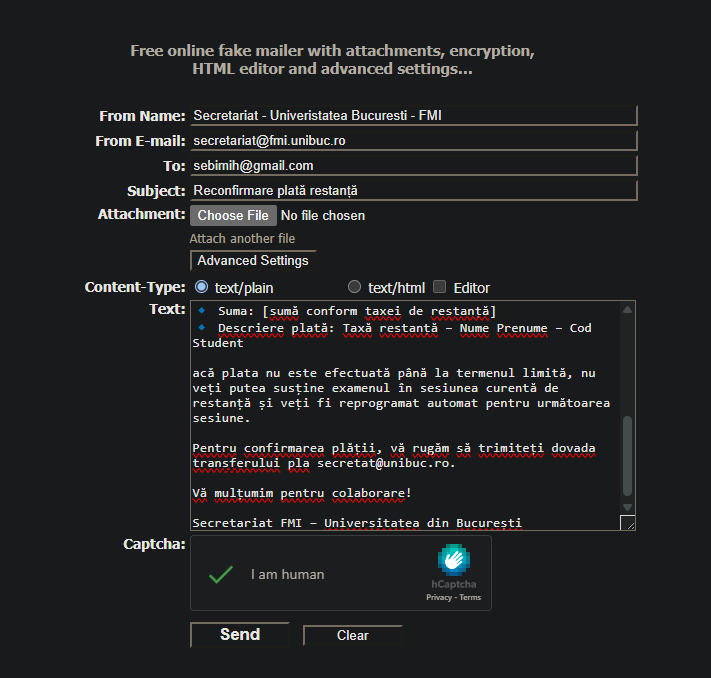
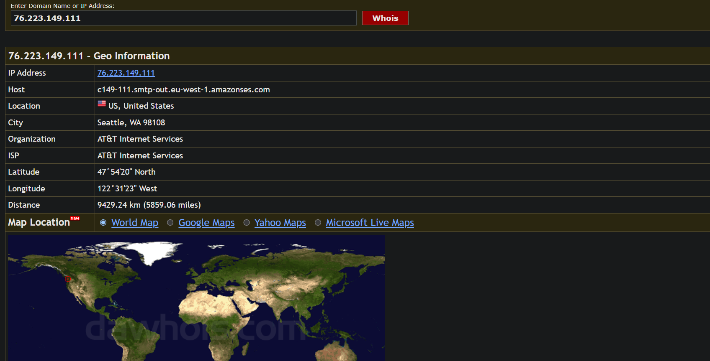
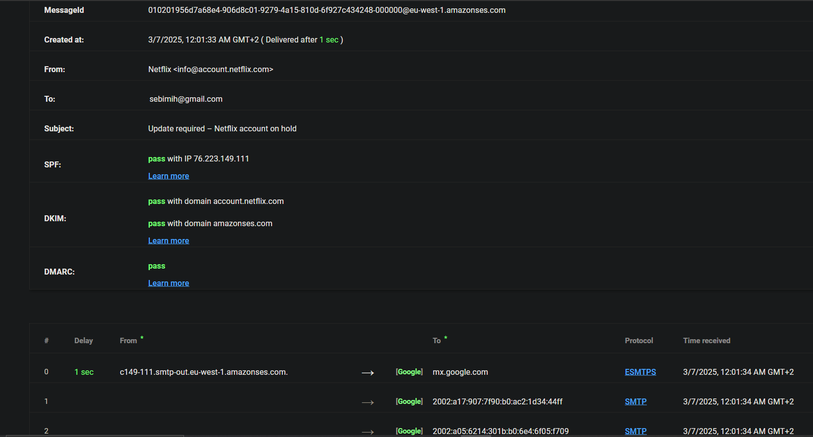

# Exercitiul 1

| Termen | Definitie |
|---	|---	|
| (A) Inginerie socială | (6) Un termen colocvial care poate fi folosit pentru a descrie orice atac de phishing foarte vizat. |
| (B) Phishing | (4) O încercare de a păcăli pe cineva să dezvăluie informații (de exemplu, o parolă) care pot fi folosite pentru a ataca sisteme sau rețele. |
| (C) Whaling | (1) Un tip specific de phishing care vizează membrii de rang înalt ai organizațiilor. |
| (D) Pharming | (3) Utilizarea mijloacelor tehnice pentru a redirecționa utilizatorii către accesarea unui site Web fals, mascat drept unul legitim și divulgarea informațiilor personale. |
| (E) Spear phishing | (2) O tehnică pentru încercarea de a achiziționa date sensibile, cum ar fi numerele de cont bancar, printr-o solicitare frauduloasă prin e-mail sau pe un site web, în care făptuitorul se maschează ca o afacere legitimă sau o persoană de încredere. |
| (F) Spoofing | (5) Falsificarea adresei de trimitere a unei transmisii pentru a obține intrarea ilegală într-un sistem securizat.  |

# Exercitiul 2

- Formatare necorespunzatoare
- Mesajul a fost identificat automat ca fiind junk
- Mesajul butonului nu este corect
- Textul nu este corect scris, greseli gramaticale, nu are diacritice
- Adresa de email a expeditorului nu are legatura directa cu ING Back Romania
- Titlul email-ului nu este specific

# Exercitiul 3

SPF = Sender Policy Framework  
DKIM = DomainKeys Identified Mail  
DMARC = Domain-based Message Authentication, Reporting and Conformance  

### Ce beneficii ati obtine daca atacul ar fi cu succes?
- Date personale sensibile: nume, prenume, IBAN, bani, adresa

```
Stimate student,

În urma unei actualizări recente a sistemului de plăți al Facultății de Matematică și Informatică, Universitatea din București, dorim să vă informăm că IBAN-ul pentru plata taxei de restanță a fost modificat.

Conform noilor reglementări administrative, sumele achitate către vechiul IBAN vor fi returnate automat în contul dumneavoastră în termen de maximum 3 zile lucrătoare. Totuși, pentru a putea participa la sesiunea de restanță programată, este necesar să retransferați suma aferentă taxei către noul IBAN.

Detalii plată:
🔹 IBAN nou: ROBT 1823 7850 1638 8537 4587
🔹 Beneficiar: Universitatea din București – Facultatea de Matematică și Informatică
🔹 Suma: 100 RON
🔹 Descriere plată: Taxă restanță – Nume Prenume – Numar Matricol Student

acă plata nu este efectuată până la termenul limită, nu veți putea susține examenul în sesiunea curentă de restanță și veți fi reprogramat automat pentru următoarea sesiune.

Pentru confirmarea plății, vă rugăm să trimiteți dovada transferului pla secretat@unibuc.ro.

Vă mulțumim pentru colaborare!

Secretariat FMI – Universitatea din București
```



## Email legitim



```
#
# ARIN WHOIS data and services are subject to the Terms of Use
# available at: https://www.arin.net/whois_tou.html
#
# If you see inaccuracies in the results, please report at
# https://www.arin.net/resources/whois_reporting/index.html
#


NetRange:       76.223.0.0 - 76.223.175.255
CIDR:           76.223.160.0/20, 76.223.0.0/17, 76.223.128.0/19
NetName:        AMAZO-4
NetHandle:      NET-76-223-0-0-1
Parent:         NET76 (NET-76-0-0-0-0)
NetType:        Direct Allocation
OriginAS:       AS16509
Organization:   Amazon.com, Inc. (AMAZO-4)
RegDate:        2018-01-10
Updated:        2018-03-07
Ref:            https://whois.arin.net/rest/net/NET-76-223-0-0-1


OrgName:        Amazon.com, Inc.
OrgId:          AMAZO-4
Address:        Amazon Web Services, Inc.
Address:        P.O. Box 81226
City:           Seattle
StateProv:      WA
PostalCode:     98108-1226
Country:        US
RegDate:        2005-09-29
Updated:        2017-01-28
Comment:        For details of this service please see
Comment:        http://ec2.amazonaws.com/
Ref:            https://whois.arin.net/rest/org/AMAZO-4


OrgTechHandle: ANO24-ARIN
OrgTechName:   Amazon EC2 Network Operations
OrgTechPhone:  +1-206-266-4064 
OrgTechEmail:  amzn-noc-contact@amazon.com
OrgTechRef:    https://whois.arin.net/rest/poc/ANO24-ARIN

OrgAbuseHandle: AEA8-ARIN
OrgAbuseName:   Amazon EC2 Abuse
OrgAbusePhone:  +1-206-266-4064 
OrgAbuseEmail:  abuse@amazonaws.com
OrgAbuseRef:    https://whois.arin.net/rest/poc/AEA8-ARIN

OrgNOCHandle: AANO1-ARIN
OrgNOCName:   Amazon AWS Network Operations
OrgNOCPhone:  +1-206-266-4064 
OrgNOCEmail:  amzn-noc-contact@amazon.com
OrgNOCRef:    https://whois.arin.net/rest/poc/AANO1-ARIN


#
# ARIN WHOIS data and services are subject to the Terms of Use
# available at: https://www.arin.net/whois_tou.html
#
# If you see inaccuracies in the results, please report at
# https://www.arin.net/resources/whois_reporting/index.html
#
```

**Analiza header**



