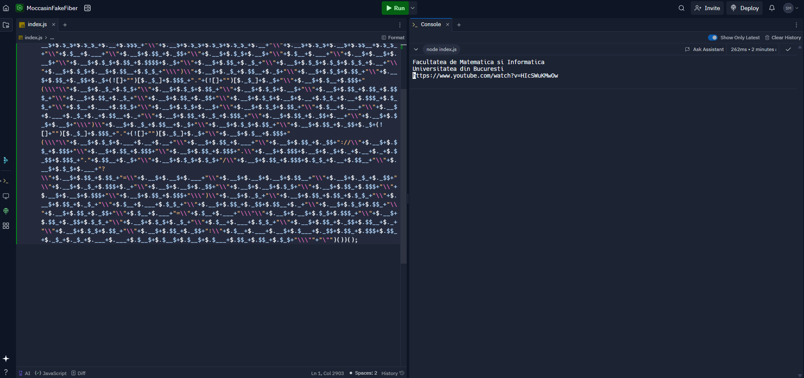
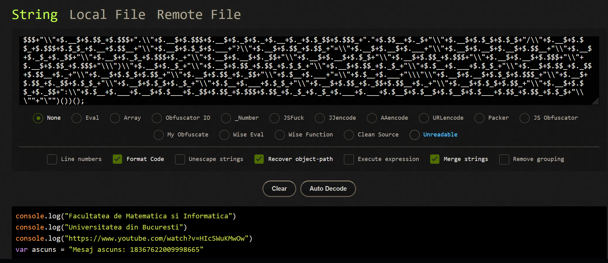
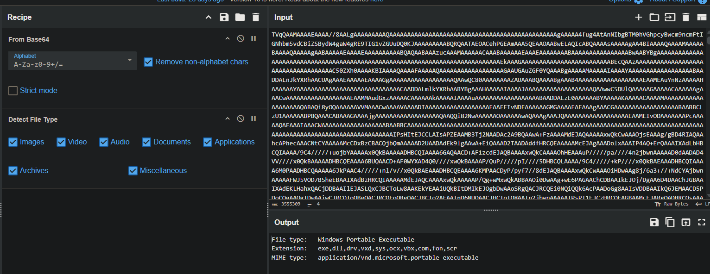

[Link scripts](https://replit.com/@sebimih1234/MoccasinFakeFiber#index.js)

# Exercitiul 1
## a)

- Ofuscare extremă a codului
- Construcția unui alfabet prin conversii implicite
- Construirea unei instrucțiuni JavaScript valide
- Cel mai probabil codul este rulat prin eval(), ceea ce înseamnă că scopul său final este să ruleze un alt cod JavaScript pe mașina utilizatorului
- Construiește un URL   
- Injectează și rulează cod JavaScript ascuns

## b)

- Am rulat codul de mai sus intr-un mediu izolat si sigur

## c)
### Rezultat
```
Facultatea de Matematica si Informatica  
Universitatea din Bucuresti  
https://www.youtube.com/watch?v=HIcSWuKMwOw  
var ascuns = "Mesaj ascuns: 18367622009998665"  
```





## d)

- generat folosind un ofuscator automat: JJEncode, JSFuck

# Exercitiul 2
## a)
- codul rezultat rulează într-un mediu Windows Script Host (WScript), utilizând ActiveXObject pentru a interacționa cu sistemul de fișiere

## b)
- cu toate ca este un script cu scop educational, si nu provoaca foarte multe pagube in sistem, poate fi considerat malware pentru ca are ofuscare intenționată

```
WScript.Echo("You have been hacked!");
WScript.Echo("I hope you did not run this on your own PC...");

var f="Facultatea";
var mi="de Matematica si Informatica";
var unibuc="Universitatea din Bucuresti";
var curs="Curs Info anul 3";
var minciuna="Acesta este un malware. Dispozitivul este compromis";
var adevar="Stringul anterior este o minciuna";

try{
    var obj=new ActiveXObject("Scripting.FileSystemObject");
    var out=obj.OpenTextFile("./fmi.txt",2,true,0);
    out.WriteLine("Bun venit la acest laborator :)");
    out.Close();
    var fle=obj.GetFile("./fmi.txt");
    fle.attributes=2
}
catch(err)
{
    WScript.Echo("Do not worry. Ghosts do not exist!")
}
```

## c)
- script cu scop educational

# Exercitiul 3
## a)
- Acelasi lucru ca la exercitul 2
1. Afișează mesaje
2. Crează un obiect ActiveX
3. Manipulare + Scriere in fisiere
4. Gestionare erori

## b)
- `\x$$` sunt caractere ASCII reprezentate în hexazecimal
-  `\x` este un prefix care denotă o valoare hexazecimală a unui caracter

## c)
- In primul sample avem toate mesajele din variabile in text clar, in timp ce in al doilea sample le avem encodate sub formatul hexadecimal
- In primul sample avem obfuscare pentru comenzile de WScript, in timp ce in al doilea sample le avem direct fara sa fie nevoie de o parsare

# Exercitiul 4
```
//aGVsbG8gd29ybGQ=                           hello world
//dGhpcyBzYW1wbGUgaXMgYSBqYXZhc2NyaXB0       this sample is a javascript
//SmF2YVNjcmlwdCBzYW1wbGU=                   JavaScript sample
//Rk1JIFVOSUJVQw==                           FMI UNIBUC
//RmFjdWx0YXRlYSBkZSBNYXRlbWF0aWNhIHNpIEluZm9ybWF0aWNh       Facultatea de Matematica si Informatica
//RmVsaWNpdGFyaQ==																						Felicitari
var JSZQ93 = CreateObject("WScript.Shell"),
//VW5pdmVyc2l0YXRlYSBkaW4gQnVjdXJlc3Rp                      Universitatea din Bucuresti
//RGV6YWN0aXZhdGkgYW50aXZpcnVzdWwgaW5haW50ZSBkZSBhIHJ1bGEgYWNlc3QgZXhlcmNpdGl1       Dezactivati antivirusul inainte de a rula acest exercitiu
	FZ52 = JSZQ93.ExpandEnvironmentStrings(FZ52);
//75 6e 69 62 75 63 20 69 6e 20 68 65 78				unibuc in hex
//U3VzcGljaW9z																	Suspicios
	//TGFib3JhdG9y										Laborator
	//VU5JQlVDIEZNSQ==						UNIBUC FMI
	//VW5pdmVyc2l0YXRlYSBkaW4gQnVjdXJlc3RpIEZhY3VsdGF0ZWEgZGUgTWF0ZW1hdGljYSBzaSBJbmZvcm1hdGljYQ==			Universitatea din Bucuresti Facultatea de Matematica si Informatica

	//QWNlc3RhIGVzdGUgdW4gc2NyaXB0						Acesta este un script
	//QWNlc3RhIGVzdGUgdW4gY29tZW50YXJpdQ==		Acesta este un comentariu
	//Q29tZW50YXJpdQ==												Comentariu
}	
//VW5pdmVyc2l0YXRl													Universitate
	//UnVu																			Run
}
//UVdObGMzUWdZMjl0Wlc1MFlYSnBkU0JsYzNSbElHRnpZM1Z1Y3c9PQ==  		Acest comentariu este ascuns
//VVZkT2JHTXpVV2RaTWpsMFdsYzFNRmxZU25Ca1UwSnNZek5TYkVsSFJucFpNMVoxWTNjOVBRPT0=			Acest comentariu este ascuns
```

## a)
- Se foloseste de WScript pentru a putea compila un nou program, cu mai multe drepturi, pe care sa il ruleze ulterior
- Creeaza un executabil, care foloseste libmingwex-0.dll 

## b)
- Daca folosesc Cyberchef pot sa identific faptul ca tot payload-ul face parte dintr-un executabil, care ofera unui atacator oportunitati de a exploata vulnerabilitati

```
File type:   Windows Portable Executable
Extension:   exe,dll,drv,vxd,sys,ocx,vbx,com,fon,scr
MIME type:   application/vnd.microsoft.portable-executable
```



## c)
- Da
- Urla Windows Security, doar cand dezarhivez folderul
- Este foarte usor identificat prin analiza statica a antivirus-ului

## d)
- https://www.virustotal.com/gui/file/a196ea13937f9b858c9fb2a56eecf139d324a022cbd21adcc217f7e581a73e21
- malware => TROJAN

## e)
- https://www.virustotal.com/gui/file/4d6bd936cb25a2111392b84ba13077bd87c24309e57ae8c2f99141197776278d
- este mai greu de detectat
- obfuscarea complica analiza statică

