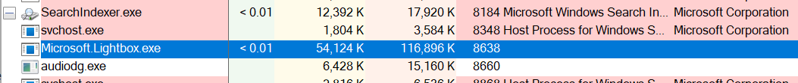
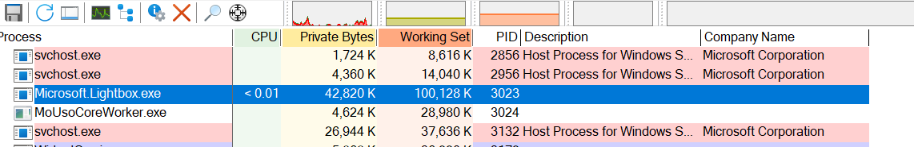

# Exercitiul 1

### a)
Pentru a putea intelege mai bine ce se intampla am folosit inca o poza normala ca sa pot vedea ce se intempla atunci cand o poza este afisata/deschisa

- Process Explorer:
  - Imagine inofensiva

  - Imagine malitioasa

  - Putem observa ca nu exista nimic suspicios care sa ne dea vreo banuiala ca a doua imagine este malitioasa.
  - Consumul de resturse este aproximativ la fel

- Process Monitor
  - [imagine_malware.csv](imagine_malware.CSV) 
  - [imagine_inofensiva.csv](imagine_inofensiva.CSV)
  - Am urmarit Windows API calls
  - **imaginea inofensiva** face Windows API calls folosind HKLM (HKEY_LOCAL_MACHINE) si HKCR (HKEY_CLASSES_ROOT)
    - HKLM => contine configuratii globale pentru tot sistemul, variabile pentru toti utilizatorii
    - HKCR => contine asocieri de fisiere, indentificatori, tipuri de obiecte folosite de aplicatii pentru a sti cum sa deschisa fisierele sau cum sa interactioneze cu diverse componente din sistem
  - **imaginea malitioasa** face Windows API calls folosind HKLM, HKCR si HKCU (HKEY_CURRENT_USER)
    - multiple probleme semnalate de Windows: **Buffer Overflow**
    - incearca aceleasi opeartii de mai multe ori
    - are toate permisiunile de acces pentru HKCU: **All Access**
    - HKCU = contine toate setarile si preferintele utilizatorului curent care este logat in Windows. Cere acces la informatiile de localizare si starile unor aplicatii precum Climchamp si DesignerEditor

### b)
- Finalul textului decodat de HxD este suspicios pentru ca putem sa descifram un cod scris in C/C++ care foloseste Windows API calls [photo_hex.txt](photo_hex.txt)  
- Observam urmatoarele keywords: "InitializeCriticalSection", "EnterCriticalSection", "fwrite", "mingw", "libstdc___6_dll_iname", "strcat", "_LoadLibraryA@4", "_GetProcAddress@8"
- Imaginea este cel mai probabil un binar PE cu scopuri malitioase


### c)
https://www.virustotal.com/gui/file/dbd3b32b7327855cd335f14becb7f155e8fa166bf440f856752d87b7a44fdda6

Foarte putine detectari, 2/60


### d)
- [textul suspicios ca png](https://www.virustotal.com/gui/file/9129edc843fb2ecdb1189049b6b4629d8a7049ced632a5b37b3dd31205021185) - nicio detectare
- [textul supsicios ca txt](https://www.virustotal.com/gui/file/80ac7e557aa1b0ef5b99274e7730fb7bf8dc9838f037a0c7b49119f87f66f494) - nicio detectare
- Cel mai probabil nu sunt detectate pentru ca este interpretat ca un program simplu de C/C++ 


### e)
Da, cele 3 DLL-uri apar in textul suspicios din poza. Are nevoie de ele pentru a putea compila si executa .exe-ul cu succes. 


### f)
Imaginea este un malware pentru ca:
- imaginile nu executa cod aditional
- ascunde intentiile reale in spatele unei simple poze 
- exploateaza vulnerabilitatile in programul de vizualizare a imaginilor din Windows 
- are un comportament distructiv


# Exercitiul 2
- Atacul se numeste Stack Buffer Overflow, daca am folosit arhitectura IA-32, am putea sa suprascriem valoarea din variabila **input** pentru ca atunci cand sunt alocate pe stiva cele 2 variabile **pass** si **input** sunt alocate continuu in memorie, contiguu, una dupa cealalta. Daca functia std::cin, ar putea sa citeasca oricate caractere ii dam, fara sa verifice dimensiunea vectorului **input**, am putea sa scriem orice parola vrem in celalalt vector **pass**. Asta se intampla datorita faptului ca valorile adreselor variabilelor din stiva cresc.
- Parolele care merg sunt "fmiSSI<orice-sufix>", datorita modului in care functia std::cin functioneaza, care pastreaza primele doar primele 6 caractere. 


# Exercitiul 3
```
import hashlib
import requests
import json


def calculate_sha256(file_path):
    sha256_hash = hashlib.sha256()
    with open(file_path, "rb") as f:
        for byte_block in iter(lambda: f.read(4096), b""):
            sha256_hash.update(byte_block)
    return sha256_hash.hexdigest()


def check_virustotal(api_key, file_hash):
    url = f"https://www.virustotal.com/api/v3/files/{file_hash}"
    headers = {
        "x-apikey": api_key
    }

    try:
        response = requests.get(url, headers=headers)
        result = response.json()

        if "data" in result and "attributes" in result["data"]:
            attributes = result["data"]["attributes"]
            if "last_analysis_stats" in attributes:
                stats = attributes["last_analysis_stats"]
                return stats.get("malicious", 0) + stats.get("suspicious", 0)

        print("No detection information found in the VirusTotal response.")
        return 0

    except requests.exceptions.RequestException as e:
        print(f"VirusTotal API Request Error: {e}")
        return None


file_path = "SSI L8 - Introducere in inginerie inversa.pdf"
api_key = "fbca19394046bdc5f09b40b637dff2cbe56090812df7febddd95e4becb7fa931"

file_hash = calculate_sha256(file_path)
print(f"File SHA256: {file_hash}")

detection_count = check_virustotal(api_key, file_hash)
if detection_count is not None:
    print(f"The number of antivirus engines that detect the file: {detection_count}")
```


# Exercitiul 4
